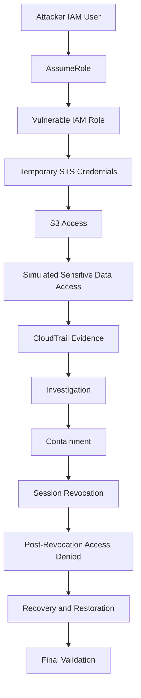

# AWS Attack Chain Diagram

Attack Chain Summary
Attacker authenticated as the aws-attack-chain-lab-attacker IAM user.
Attacker assumed the deliberately vulnerable IAM role.
Temporary STS credentials were issued.
The compromised role accessed the vulnerable S3 bucket.
Simulated sensitive data was retrieved.
CloudTrail recorded the attack activity.
CloudTrail evidence was investigated.
The compromised access path was contained.
Existing sessions were revoked.
Post-revocation testing confirmed access was denied.
Lab permissions were restored.
Final validation confirmed legitimate access was restored.
Evidence
incident-timeline.md
cloudtrail-forensics.md
containment-validation.md
evidence/attack-path-summary.md
evidence/exfiltration/sensitive-data-recovered-final.txt
evidence/cloudtrail/
