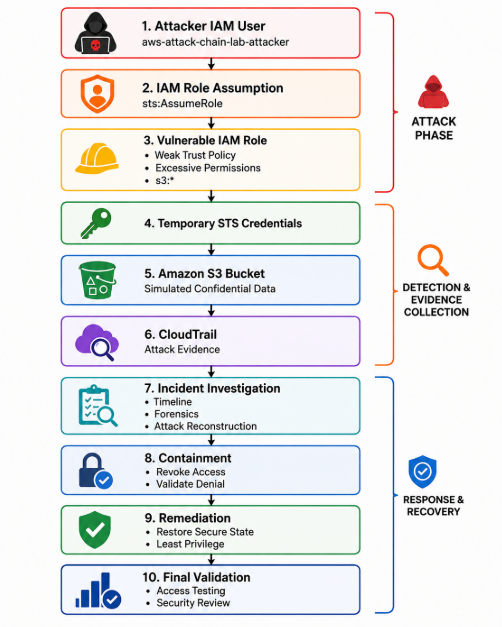

# AWS Attack Chain & Incident Response


## Table of Contents

- [Overview](#overview)
- [Attack Chain](#attack-chain)
- [Architecture / Attack Path](#architecture--attack-path)
- [Project Objectives](#project-objectives)
- [Incident Response Lifecycle](#incident-response-lifecycle)
- [Key Findings](#key-findings)
- [Detection Results](#detection-results)
- [Incident Response Metrics](#incident-response-metrics)
- [Evidence](#evidence)
- [Lessons Learned](#lessons-learned)
- [Tools and Technologies](#tools-and-technologies)
- [Project Structure](#project-structure)
- [Portfolio Highlights](#portfolio-highlights)
- [Security Notice](#security-notice)

## Overview

A hands-on AWS cloud security laboratory demonstrating a complete **attack-to-response lifecycle** against a deliberately vulnerable AWS environment.

The project combines **offensive cloud security, IAM privilege escalation, AWS logging and forensics, incident response, containment, remediation, and post-incident validation**.

A vulnerable AWS environment was deployed using Terraform and subjected to an authorized attack simulation. The attack chain demonstrated how an attacker could move from an initial IAM identity to a vulnerable IAM role, obtain temporary STS credentials, access an S3 bucket, and retrieve simulated sensitive data.

The environment was then investigated using AWS CloudTrail evidence, contained, remediated, and validated.

The project intentionally documents both **successful security controls** and **detection gaps**. CloudTrail provided confirmed forensic evidence of the attack, while GuardDuty and Security Hub were verified as inactive in the lab account and therefore did not generate findings.

---

## Attack Chain

**Attacker IAM Identity**

->

**Vulnerable IAM Role**

Weak Trust Policy + Broad Permissions

->

**Temporary STS Credentials**

->

**S3 Access**

->

**Simulated Sensitive Data Retrieval**

->

**CloudTrail Evidence**

->

**Investigation**

->

**Containment**

->

**Session Revocation**

->

**Remediation**

->

**Recovery & Validation**

### Attack Path Summary

**Attacker IAM Identity**

-> Assumes vulnerable IAM role

-> Obtains temporary STS session credentials

-> Uses role permissions to access S3

-> Retrieves simulated sensitive data

-> Activity recorded in AWS CloudTrail

-> Attack reconstructed through forensic investigation

-> Compromised access contained

-> Temporary session access revoked

-> Vulnerable configuration remediated

-> Security posture validated after remediation

---

## Architecture / Attack Path

The laboratory was designed around a deliberately vulnerable AWS environment containing intentionally weak security configurations.

**AWS Attack-Chain Lab**

-> **Attacker IAM Identity**

-> `sts:AssumeRole`

-> **Vulnerable IAM Role**

* Weak Trust Relationship
* Excessive Permissions
* `s3:*` Access

-> **Temporary STS Session**

-> **Amazon S3 Bucket**

* Simulated Confidential Data

-> `GetObject`

-> **Sensitive Data Retrieved**

-> **AWS CloudTrail**

-> **Forensic Investigation**

* Timeline Reconstruction
* Attack Path Analysis
* Evidence Preservation

-> **Containment**

* Access Revocation
* Session Revocation
* Access Validation

-> **Remediation**

* Restore Secure State
* Validate Permissions
* Perform Post-Remediation Security Validation

---

## Attack Chain Visualization



The complete investigation and evidence are documented in:

* `04-investigation/attack-chain-diagram.md`

---

## Project Objectives

The project was designed to demonstrate the following capabilities:

* Deploying vulnerable AWS infrastructure with Terraform
* Understanding AWS IAM trust relationships and permissions
* Performing an authorized cloud attack simulation
* Demonstrating IAM role assumption
* Using temporary STS credentials
* Identifying excessive IAM permissions
* Accessing protected S3 resources through an over-permissioned role
* Retrieving simulated sensitive data
* Investigating AWS CloudTrail activity
* Reconstructing an attack timeline
* Preserving forensic evidence
* Identifying security monitoring gaps
* Containing compromised access
* Revoking access to active sessions
* Remediating vulnerable configurations
* Validating the environment after remediation
* Measuring incident-response performance
* Documenting the complete security lifecycle

---

## Incident Response Lifecycle

The project follows a complete security lifecycle:

1. Preparation
2. Vulnerable Environment Deployment
3. Authorized Attack Simulation
4. Detection & Visibility Assessment
5. Investigation
6. Containment
7. Remediation
8. Recovery
9. Validation
10. Lessons Learned

---

## Key Findings

### 1. Over-Permissioned IAM Role

The vulnerable IAM role provided excessive permissions, including broad S3 access.

This demonstrated how excessive permissions can enable an attacker who successfully assumes a role to access resources beyond what is required for legitimate business operations.

### 2. Weak IAM Trust Configuration

The vulnerable role contained an intentionally weak trust relationship that supported the simulated privilege-escalation path.

This demonstrated the importance of reviewing both:

* Identity-based permissions
* Resource trust policies

### 3. Successful IAM Role Assumption

The attacker identity successfully assumed the vulnerable IAM role.

The role assumption was confirmed through AWS CloudTrail evidence and temporary STS session activity.

### 4. Successful S3 Data Access

The assumed role was used to access the vulnerable S3 environment and retrieve simulated sensitive data.

The retrieved data was intentionally simulated and did not contain real customer information.

### 5. CloudTrail Provided Confirmed Forensic Evidence

AWS CloudTrail provided the primary confirmed evidence used to reconstruct the attack.

The investigation established:

* The attacker identity
* The role assumption
* The assumed-role session
* S3 access activity
* Sensitive-data retrieval
* The sequence of attack events

### 6. GuardDuty Detection Gap

GuardDuty was verified in the attack-chain lab account and no detector was enabled at the time of testing.

Therefore:

* No GuardDuty finding was generated
* The attack was not detected by GuardDuty
* The absence of GuardDuty was documented as a detection gap

The project does not claim that GuardDuty detected the attack.

### 7. Security Hub Visibility Gap

Security Hub was also verified and the lab account was not subscribed to the service.

Therefore:

* No Security Hub finding was generated
* GuardDuty findings could not be aggregated
* Security Hub did not contribute to attack detection
* Security Hub did not contribute to the forensic investigation

This limitation is explicitly documented rather than overstating the capabilities demonstrated by the lab.

### 8. Successful Containment

Containment activities included revoking compromised access, testing existing session access, and validating that revoked sessions could no longer access the protected S3 object.

### 9. Remediation and Validation

The vulnerable configuration was restored to the intended secure lab state.

Post-remediation validation confirmed that:

* The compromised temporary session was no longer able to access the protected resource
* Access controls were restored
* CloudTrail evidence was preserved
* The environment was validated after remediation

---

## Detection Results

| Security Control               | Result                      |
| ------------------------------ | --------------------------- |
| AWS CloudTrail                 | Confirmed forensic evidence |
| GuardDuty                      | Not enabled                 |
| GuardDuty Finding              | None generated              |
| Security Hub                   | Not subscribed              |
| Security Hub Finding           | None generated              |
| CloudTrail Investigation       | Successful                  |
| Attack Timeline Reconstruction | Successful                  |
| Containment Validation         | Successful                  |
| Remediation Validation         | Successful                  |

The project demonstrates an important real-world security lesson:

> A security investigation does not depend on a single detection product. When higher-level detection services are unavailable, correctly configured logging and forensic evidence can still provide the visibility required to reconstruct an incident.

---

## Incident Response Metrics

The project tracks incident-response metrics covering:

* Attack execution
* Detection and visibility
* Investigation
* Containment
* Remediation
* Validation

Detailed metrics are documented in:

* `metrics.md`

These metrics provide a measurable view of the incident-response lifecycle rather than treating the exercise as only a technical demonstration.

---

## Evidence

The project contains evidence covering the complete attack and response lifecycle.

### Vulnerable Environment

* `01-vulnerable-environment/terraform/`

Contains the Terraform configuration used to deploy the deliberately vulnerable environment.

### Attack Simulation

* `02-attack-simulation/`

Contains documentation of the authorized attack simulation and privilege-escalation path.

### Detection Assessment

* `03-detection/guardduty-findings.md`
* `03-detection/securityhub-findings.md`

Documents the verification of GuardDuty and Security Hub and the identified detection gaps.

### Incident Response

* `03-incident-response/incident-findings.md`
* `03-incident-response/incident-timeline.md`
* `03-incident-response/containment.md`
* `03-incident-response/remediation.md`
* `03-incident-response/evidence/cloudtrail-1050-getobject.json`

### Investigation

* `04-investigation/cloudtrail-forensics.md`
* `04-investigation/incident-timeline.md`
* `04-investigation/attack-chain-diagram.md`
* `04-investigation/evidence/attack-path-summary.md`
* `04-investigation/containment-validation.md`

### Remediation and Validation

* `05-containment-remediation/before-after-prowler-scan.md`

### Final Report

* `05-final-report.md`

The final report consolidates the attack, investigation, containment, remediation, validation, findings, and lessons learned.

---

## Lessons Learned

### Least Privilege Is Critical

Excessive IAM permissions can turn a compromised identity into a significant cloud security incident.

IAM permissions should be limited to the minimum access required for the intended workload.

### Trust Policies Require the Same Attention as Permissions

IAM role security depends on both:

* Who is allowed to assume the role
* What the role is allowed to do after it is assumed

A secure role requires both a restrictive trust policy and least-privilege permissions.

### Logging Is Essential for Cloud Forensics

CloudTrail provided the evidence required to reconstruct the attack path and establish the sequence of events.

Centralized and retained cloud logs are critical for incident investigation.

### Detection Services Must Be Verified, Not Assumed

The laboratory demonstrated that having security services available in an AWS environment does not mean they are actively detecting incidents.

GuardDuty and Security Hub were explicitly verified and documented as inactive in the lab account.

### Containment Must Be Validated

Revoking access is not enough.

The project tested whether previously obtained temporary session access remained usable after containment actions and confirmed the resulting access state.

### Security Validation Should Continue After Remediation

The incident-response lifecycle does not end when the immediate threat is contained.

Post-remediation validation confirms whether the environment has actually returned to the intended security posture.

---

## Tools and Technologies

### AWS Services

* AWS IAM
* Amazon S3
* AWS STS
* AWS CloudTrail
* Amazon GuardDuty
* AWS Security Hub

### Security Tools

* Pacu
* Prowler
* AWS CLI

### Infrastructure and Automation

* Terraform
* Python

### Version Control

* Git
* GitHub

---

## Project Structure

```text
aws-attack-chain-incident-response/

├── 01-vulnerable-environment/
│   └── terraform/
├── 02-attack-simulation/
├── 03-detection/
├── 03-incident-response/
│   └── evidence/
├── 04-investigation/
│   └── evidence/
├── 05-containment-remediation/
├── 05-final-report.md
├── metrics.md
└── README.md
```

---

## Portfolio Highlights

This project demonstrates practical experience across multiple areas of cloud security:

* Cloud Attack Simulation
* AWS IAM Security
* Privilege Escalation Analysis
* CloudTrail Forensics
* Incident Response
* Cloud Containment
* Access and Session Revocation
* Security Monitoring Validation
* Detection Gap Analysis
* Security Remediation
* Post-Incident Validation
* Infrastructure as Code
* Security Documentation

The project is designed to demonstrate not only how to identify a cloud security weakness, but also how to **simulate exploitation, investigate the resulting incident, contain the compromise, remediate the environment, and validate the final security state**.

---

## Security Notice

This project is an authorized security laboratory using deliberately vulnerable infrastructure and simulated data.

No real customer data, production systems, or unauthorized third-party infrastructure was targeted.

All offensive security activities were performed within an environment controlled for authorized security testing and educational purposes.
